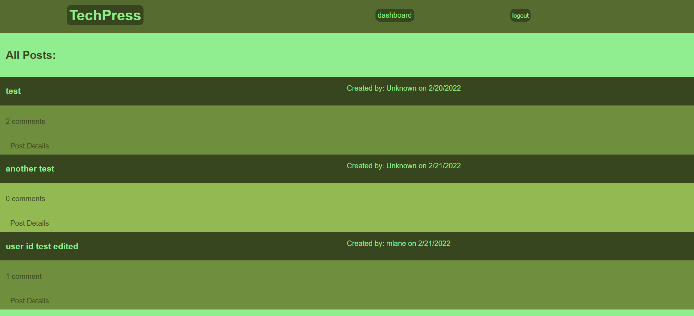

## CMS-Style Blog

# Description
The purpose of this project was to create a CMS-Style blog where user can post blogs and comment on them.  It enabled me to practice implementing the MVC design pattern, practice deploying an app to heroku, and practice creating html templates with handlebars.

# Features
* The user is presented with a homepage on which the user can view all of the posts and their respective comments.
* The user can click the login option to login or signup to create a new user.
* The user, upon logging in, is presented with a dashboard on which they can see their posts and create a new post.
* The user can click on the post details to see comments and can add new comments if they are logged in.
* Comments can be deleted by clicking the delete button for that comment.

# Technologies Used
* Node.js
* Express
* Express-sessions
* bcrypt
* Heroku
* Handlebars
* HTML/CSS
* Javascript

# Screenshots

# Links
* Heroku app: https://cms-style-blog-challenge.herokuapp.com/  
* Github repo: https://github.com/MirandaL27/CMS-Style-Blog

# Credits
Miranda Lane

